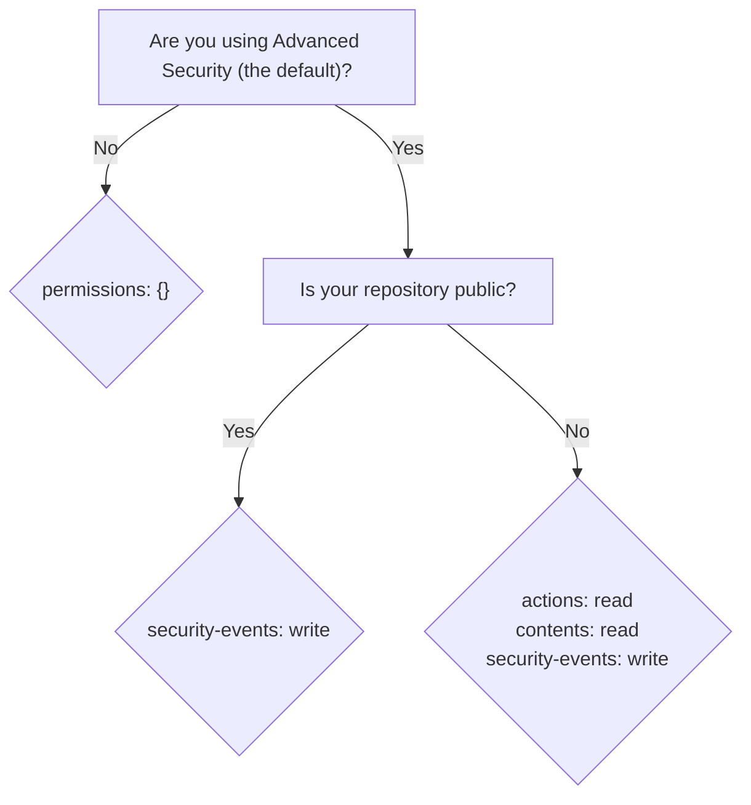

# zizmor-action 🌈

Run [`zizmor`] from GitHub Actions!

> [!WARNING]
> This action is ready for public use, but it is still in early development.
> Please report any issues you encounter, and be aware that backwards
> incompatible changes may be made until a stable version is released.

## Table of Contents

- [Quickstart](#quickstart)
  - [Usage with Github Advanced Security (recommended)](#usage-with-github-advanced-security-recommended)
  - [Usage without Github Advanced Security](#usage-without-github-advanced-security)
- [Inputs](#inputs)
  - [`inputs`](#inputs)
  - [`online-audits`](#online-audits)
  - [`version`](#version)
  - [`token`](#token)
  - [`advanced-security`](#advanced-security)
  - [`annotations`](#annotations)
  - [`color`](#color)
  - [`config`](#config)
- [Outputs](#outputs)
- [Permissions](#permissions)
- [Troubleshooting](#troubleshooting)

## Quickstart

This section lists a handful of quick-start examples to get you up and
running with `zizmor` and `zizmor-action`. See the [Inputs](#inputs)
section for more details on how `zizmor-action` can be configured.

If you run into any issues, please see the [Troubleshooting](#troubleshooting)
section!

### Usage with Github Advanced Security (recommended)

> [!IMPORTANT]
> This mode requires that your repository is public or that you have
> [Advanced Security] as a paid feature on your private repository.
>
> If neither of these applies to you, you can use `zizmor-action`
> with `advanced-security: false`; see below for more details.

> [!IMPORTANT]
> In this mode, the action will **not** fail when `zizmor` produces findings.
> This is because Advanced Security encourages workflows to only fail
> on internal errors.
>
> To use workflow failure as a blocking signal, you can use GitHub's rulesets
> feature. For more information, see
> [About code scanning alerts - Pull request check failures for code scanning alerts].

> [!NOTE]
> This is the recommended way to use `zizmor-action` as it provides
> stateful analysis and enables incremental triage.

`zizmor-action` integrates with GitHub's [Advanced Security]
by default, giving you access to `zizmor`'s findings via your
repository's security tab.

```yaml
name: GitHub Actions Security Analysis with zizmor 🌈

on:
  push:
    branches: ["main"]
  pull_request:
    branches: ["**"]

permissions: {}

jobs:
  zizmor:
    runs-on: ubuntu-latest
    permissions:
      security-events: write
      contents: read # only needed for private or internal repos
      actions: read # only needed for private or internal repos
    steps:
      - name: Checkout repository
        uses: actions/checkout@de0fac2e4500dabe0009e67214ff5f5447ce83dd # v6.0.2
        with:
          persist-credentials: false

      - name: Run zizmor 🌈
        uses: zizmorcore/zizmor-action@0dce2577a4760a2749d8cfb7a84b7d5585ebcb7d # v0.5.0
```

### Usage without Github Advanced Security

If you can't or don't want to use GitHub's [Advanced Security] functionality,
you can still use `zizmor-action` without any issues or feature limitations!

To do so, you can set `advanced-security: false`
and omit the `security-events: write` permission. For example:

```yaml
name: GitHub Actions Security Analysis with zizmor 🌈

on:
  push:
    branches: ["main"]
  pull_request:
    branches: ["**"]

permissions: {}

jobs:
  zizmor:
    runs-on: ubuntu-latest
    permissions:
      contents: read # only needed for private or internal repos
      actions: read # only needed for private or internal repos
    steps:
      - name: Checkout repository
        uses: actions/checkout@de0fac2e4500dabe0009e67214ff5f5447ce83dd # v6.0.2
        with:
          persist-credentials: false

      - name: Run zizmor 🌈
        uses: zizmorcore/zizmor-action@0dce2577a4760a2749d8cfb7a84b7d5585ebcb7d # v0.5.0
        with:
          advanced-security: false
```

## Inputs

### `inputs`

*Default*: `.`

`inputs` is a whitespace-separated list of inputs to pass to `zizmor`.
It defaults to `.` (the current working directory).

This set of inputs can be anything `zizmor` would normally accept as an
input. For example, you can audit one or more files, directories, or remote
repositories:

```yaml
- name: Run zizmor 🌈
  uses: zizmorcore/zizmor-action@0dce2577a4760a2749d8cfb7a84b7d5585ebcb7d # v0.5.0
  with:
    inputs: |
      .github/workflows/fishy.yml
      my-actions/
      other-org/other-repo@main
```

See `zizmor`'s [Input collection] documentation for more information.

### `online-audits`

*Default*: `true`

`online-audits` controls whether `zizmor` runs online audits. Running without
`online-audits` is faster but will produce fewer results.

See `zizmor`'s [Audit Rules] documentation for more information on which
audits are online-only.

### `persona`

*Default*: `regular`

`persona` is the auditing "persona" to apply during audits.

It can be set to one of the following values: `regular` (the default),
`pedantic`, or `auditor`.

See `zizmor`'s [Using personas] documentation for more information
on what each persona does.

### `min-severity`

*Default*: none

`min-severity` controls the severity threshold for reported findings;
findings below the threshold will be ignored.

It can be set to one of the following values: `unknown`, `informational`,
`low`, `medium`, or `high`.

See `zizmor`'s [Filtering results] documentation for more information.

### `min-confidence`

*Default*: none

`min-confidence` controls the confidence threshold for reported findings;
findings below the threshold will be ignored.

It can be set to one of the following values: `unknown`, `low`, `medium`,
or `high`.

See `zizmor`'s [Filtering results] documentation for more information.

### `version`

*Default*: `latest`

`version` is the version of `zizmor` to use. It must be provided as
either an exact version (e.g. `v1.7.0`) or the special value `latest`,
which will always use the latest version of `zizmor`.

> [!NOTE]
> You can specify `version` with or without the `v` prefix.
> For example, `v1.7.0` and `1.7.0` are both valid and equivalent.

### `token`

*Default*: `${{ github.token }}`

`token` is the GitHub token to use for accessing the GitHub REST API
during online audits.

### `advanced-security`

*Default*: `true`

`advanced-security` controls whether `zizmor-action` uses GitHub's
[Advanced Security] functionality. If set to `false`, `zizmor-action`
will not upload results to Advanced Security, and will instead
print them to the console.

### `annotations`

*Default*: `false`

`annotations` controls whether `zizmor-action` emits GitHub annotations for
findings. When enabled, `zizmor-action` will use `zizmor`'s support
for GitHub annotations to create annotations for findings.

> [!WARNING]
> GitHub imposes **significant limits** on annotations that come from workflows:
> a single CI step within a workflow can only render 10 annotations.
> If there are more than 10 findings, only the first 10 will be rendered, and
> the rest will be logged to the action log but **not** rendered.
>
> For more information, see `zizmor`'s
> [GitHub Annotations](https://docs.zizmor.sh/usage/#github-annotations)
> documentation.

> [!WARNING]
> This option is **incompatible** with `advanced-security: true`,
> which is the default. If you set `annotations: true`, you **must**
> also set `advanced-security: false`. The action will refuse to run
> if you do not do this.

### `color`

*Default*: `true`

`color` controls whether `zizmor-action` outputs colorized log output.

### `config`

*Default*: none

`config` is the path to a custom `zizmor` configuration file (e.g., `zizmor.yml`).

See the [Configuration - Discovery] documentation for how explicit configuration files interact with `zizmor`'s default configuration loading behavior.

[Configuration - Discovery]: https://docs.zizmor.sh/configuration/#discovery

### `fail-on-no-inputs`

*Default*: `true`

`fail-on-no-inputs` controls whether the action fails if no inputs
were collected by `zizmor`. If set to `false`, the action will
succeed even if no inputs were found.

> [!IMPORTANT]
> This input only works with `zizmor v1.21.0` and later. It has no effect
> on earlier versions of `zizmor`, meaning that the action will always fail
> if no inputs are found on earlier versions.

## Outputs

### `output-file`

When `advanced-security: true`, the `output-file` output will contain a filepath
for `zizmor`'s static analysis results in the SARIF format.


## Permissions

`zizmor-action` requires different permissions depending on how you use it.

The following table summarizes the permissions required and when:

| Permission | Description | Required when? |
| ---------- | ----------- | --------------- |
| `security-events: write` | Required to upload results to [Advanced Security]. | When `advanced-security: true` (the default). |
| `contents: read` | Required to read the contents of the repository. | When `advanced-security: true` *and* the parent repository is private. |
| `actions: read` | Required to read the actions of the repository. | When `advanced-security: true` *and* the parent repository is private. |

Or, as a decision tree:



## Troubleshooting

### "Cannot run this action without Docker"

This action uses a container to run `zizmor`, which means that it
needs access to a container runtime (like Docker).

If you see this error, it _probably_ means that you are running the
action from a self-hosted runner, or from one of the GitHub-hosted runners
that does not have Docker installed. For example, the GitHub-hosted
macOS runners do not have Docker installed by default.

For self-hosted runners, you should install Docker (or a compatible
container runtime) onto the runner.

For GitHub-hosted runners, you should switch to `ubuntu-latest` or another
Linux-based runner that comes with Docker by default. You _may_ be
able to use [docker/setup-docker-action] to install Docker on other runners,
but this is **not officially supported** by this action.

### Changes introduce security alerts but no PR checks are shown

> [!NOTE]
> This is **not** a bug in `zizmor-action` or `zizmor`. It's a quirk of
> GitHub's handling of SARIF in their Advanced Security feature.

As reported in [#43], GitHub's "Advanced Security" integration is somewhat
fickle about when it decides to show checks on PRs for code scanning
alerts.

GitHub's criteria for displaying a check on a PR is documented
under [SARIF support for code scanning] and
[Triaging code scanning alerts in pull requests]. The short version is that the
check will **not** be shown **unless all lines** in the finding are included
in the PR's diff. This is unintuitive (since findings typically carry context
that extends beyond the changed lines), but it's how GitHub behaves.

If you hit this behavior, you have a few options:

1. Continue to use `zizmor-action` with `advanced-security: true`,
   but configure a [ruleset] to prevent PRs from merging until all
   code scanning alerts are resolved. This is the recommended approach,
   but you **must** configure it manually &mdash; `zizmor-action` cannot do
   it for you.
2. Set `advanced-security: false` and use another output format, like
   [annotations](#annotations) or the default ("plain") console format
   (which you get by default when you set `advanced-security: false`).
   With either of these approaches you lose the stateful tracking and triage
   of Advanced Security, but you'll also avoid this issue.

   If you choose to switch to annotations, please keep in mind
   that annotations also come with significant limitations, including a hard
   limit of 10 annotations per workflow run. See the documentation above for
   more details.


[`zizmor`]: https://docs.zizmor.sh
[Advanced Security]: https://docs.github.com/en/get-started/learning-about-github/about-github-advanced-security
[About code scanning alerts - Pull request check failures for code scanning alerts]: https://docs.github.com/en/code-security/code-scanning/managing-code-scanning-alerts/about-code-scanning-alerts#pull-request-check-failures-for-code-scanning-alerts
[Input collection]: https://docs.zizmor.sh/usage/#input-collection
[Audit Rules]: https://docs.zizmor.sh/audits/
[Using personas]: https://docs.zizmor.sh/usage/#using-personas
[Filtering results]: https://docs.zizmor.sh/usage/#filtering-results
[docker/setup-docker-action]: https://github.com/docker/setup-docker-action
[#43]: https://github.com/zizmorcore/zizmor-action/issues/43
[SARIF support for code scanning]: https://docs.github.com/en/code-security/code-scanning/integrating-with-code-scanning/sarif-support-for-code-scanning#specifying-the-location-for-source-files
[Triaging code scanning alerts in pull requests]: https://docs.github.com/en/code-security/code-scanning/managing-code-scanning-alerts/triaging-code-scanning-alerts-in-pull-requests?utm_source=chatgpt.com#about-code-scanning-results-on-pull-requests
[ruleset]: https://docs.github.com/en/repositories/configuring-branches-and-merges-in-your-repository/managing-rulesets/available-rules-for-rulesets#set-code-scanning-merge-protection

## License

This project is licensed under the MIT License.

See the [LICENSE](LICENSE) file for the full licensing terms.
